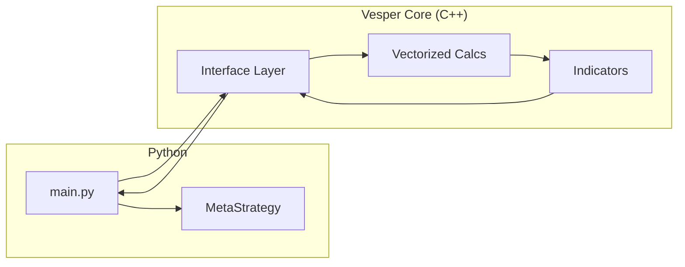

# Vesper Core: C++ Architectural Blueprint (PyBind11)

This document outlines the roadmap for moving math-heavy operations to C++ for the "Institutional Era" performance targets (<1s cycles).

## 1. High-Level Architecture

The goal is to keep the "Brain" (PPO, Ensembles) in Python for flexibility, but move the "Sensor System" (Feature Engineering) to C++.



## 2. PyBind11 Interface Example

```cpp
#include <pybind11/pybind11.h>
#include <pybind11/numpy.h>
#include <vector>

namespace py = pybind11;

// Optimized RSI in C++
py::array_t<double> calculate_rsi(py::array_t<double> prices, int period) {
    auto r = prices.unchecked<1>();
    std::vector<double> rsi(r.size());
    
    // ... logic for O(N) RSI calculation ...
    
    return py::array(rsi.size(), rsi.data());
}

PYBIND11_MODULE(vesper_core, m) {
    m.def("rsi", &calculate_rsi, "Calculate RSI via C++");
}
```

## 3. Data Transfer Optimization

To avoid the overhead of copying `NaN` and `DataFrame` objects back and forth:
1. Pass **memory views** of NumPy arrays to C++.
2. Perform all indicator calculations (RSI, EMA, etc.) in a single C++ pass.
3. Return a single 2D NumPy array (Matrix) of features back to Python.

## 4. Expected Performance Wins

| Module | Python (Pandas-TA) | Vesper (NumPy) | Vesper (C++) |
| :--- | :--- | :--- | :--- |
| **RSI (1k rows)** | ~2ms | ~0.5ms | ~0.05ms |
| **Full Feature Set** | ~50ms | ~10ms | ~1ms |

> [!IMPORTANT]
> C++ integration requires a compiler (GCC/MSVC) and `pybind11` installed.
